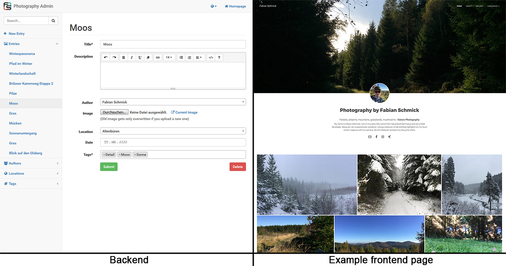

Photography
===========

This project is based on the [Symfony PHP Framework](http://symfony.com/) and should be seen as some sort of small template for photographs.
You should have experience in web development to adjust the project to your preferences.

Here is an example of how an end result could look: [fotografie.fabian-schmick.de](http://fotografie.fabian-schmick.de)



The project provides you following functionality:
- Symfony 3.4 (LTS version)
- Vagrantfile and ansible configuration for development (https://github.com/FabianSchmick/vagrant_skeleton) 
- Node packages with Gulp, Bootstrap, jQuery and many more
- Small CMS for creating new entries
- Image compression and thumbnail generation with [Imagine](https://imagine.readthedocs.io/en/latest/)
- Multilingualism in English and German
- Tag possibility for describing and filtering entries
- Lazyloading for images
- Justified Gallery with [JustifiedGallery](http://miromannino.github.io/Justified-Gallery/)
- Lightbox with [Fancybox](http://fancyapps.com/fancybox/3/)
- Dynamic Sitemap generation
- And many more 


## Installation

Clone the project
```
git clone https://github.com/FabianSchmick/photography.git
```

[Setup Symfony](https://symfony.com/doc/current/setup.html) or use [vagrantfile for local development](https://github.com/FabianSchmick/vagrant_skeleton/blob/master/README.md)

**Backend password:**

Choose a secure password for the backend `/admin` and write it in `app/config/security.yml`
after you encoded the password with symfony built in command
```
php bin/console security:encode-password
```

Now you only need to run `npm install` and `gulp deploy` in the project root to generate the stylesheet and javascript files.

If you need some example data run:
```
php bin/console doctrine:fixtures:load
```
